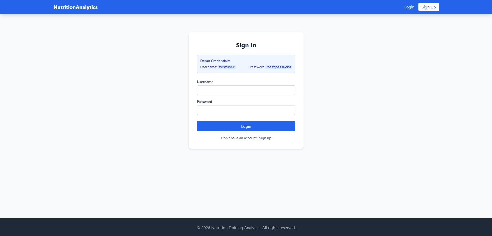
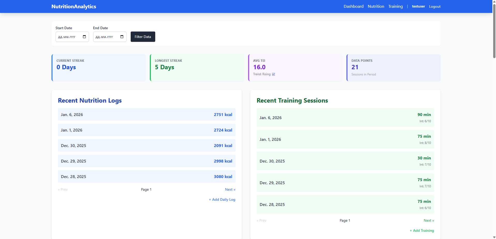
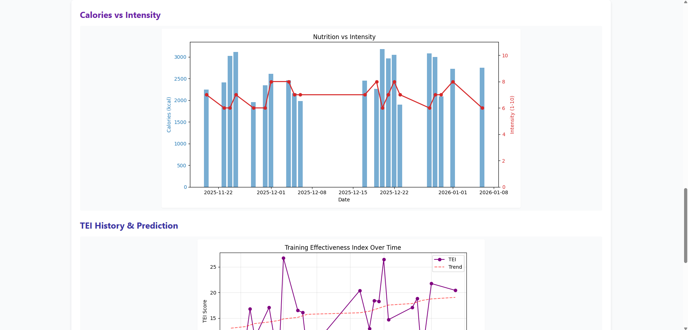
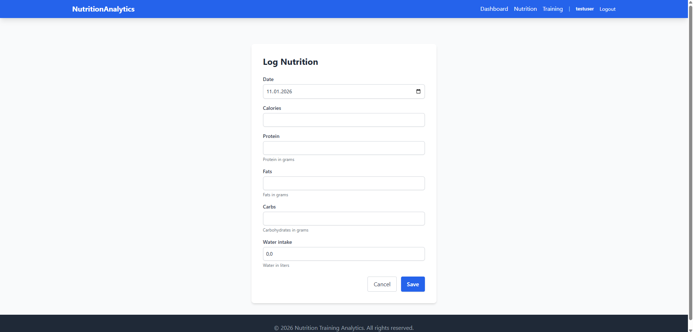
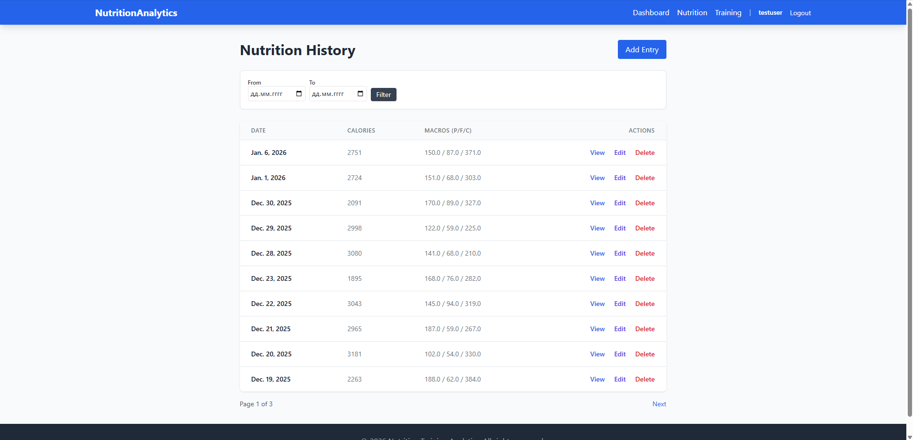
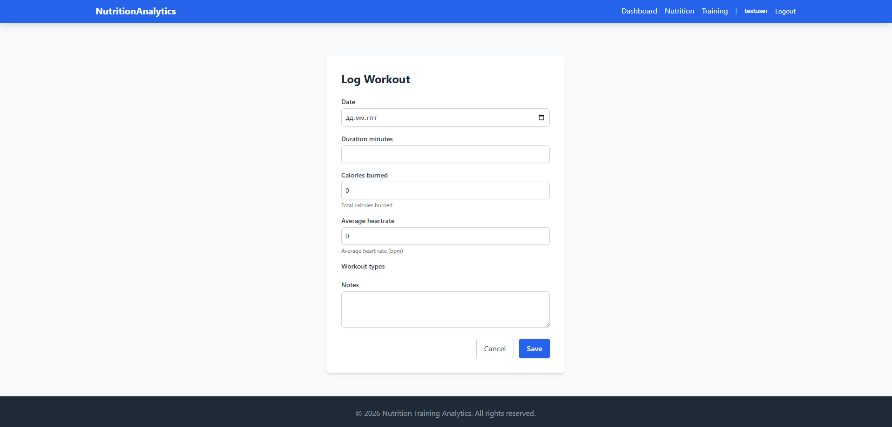
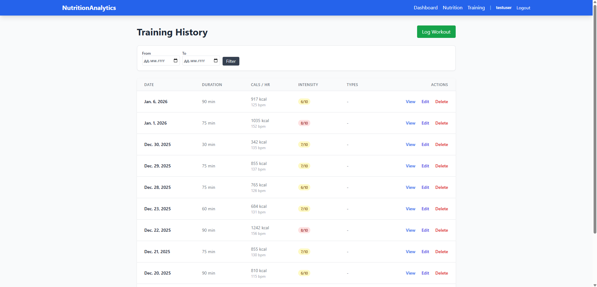

# Nutrition & Training Analytics

A Django-based web application to analyze the impact of nutrition (macros/calories) on training intensity.

**Link to project:** [Depoyed Link Placeholder]

## Technologies
*   **Python 3.11+**
*   **Django 5.x**
*   **Pandas & Matplotlib** (Analytics)
*   **Tailwind CSS** (UI via CDN)

## Features
*   **Nutrition Logging**: Track daily calories, protein, fats, carbs, and water.
*   **Workout Logging**: Record sessions with duration, intensity, and activity types.
*   **Analytics Dashboard**: Visual correlation between calorie intake and workout intensity.
*   **Responsive UI**: Built with Tailwind CSS.

## Screenshots
#### Login

#### Dashboard

#### Graphs

#### Add nutrition

#### Nutrition story

#### Add a workout

#### Training story


## Locals Setup

1.  **Clone the repository:**
    ```bash
    git clone <repo_url>
    cd nutrition-training-analytics
    ```

2.  **Setup Environment (using uv or venv):**
    ```bash
    # Using uv
    uv sync
    
    # Or standard venv
    python -m venv .venv
    source .venv/bin/activate
    pip install -r requirements.txt
    ```

3.  **Applying Migrations:**
    ```bash
    python manage.py migrate
    ```

4.  **Create Superuser:**
    ```bash
    python manage.py createsuperuser
    ```

5.  **Run Server:**
    ```bash
    python manage.py runserver
    ```

6.  **Access:**
    Open [http://127.0.0.1:8000](http://127.0.0.1:8000)

## Project Structure
*   `analytics/`: Main app containing models, views, and templates.
*   `config/`: Project configuration.
*   `TZ.md`: Technical Assignment details.
